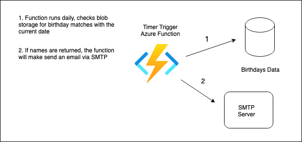

# Birthday Buddy v1.0

Birthday Buddy v1.0 is a a service to email me the list of my family and friends' birthdays that fall on the current day. 

 > After discussing with some friends, it seems the opinion on the best way to be alerted (if at all) is mixed. The long term goal for 2.0, is a tool that others can use as well. So eventually I'd lke to create customizable alerts for a mobile app that can either email, SMS, or send a push notification.

## v1.0 Design

Storing Birthday Data
- I am opting for Azure Table storage. Since the reading data occurs once a day, its being written only a few times a year, latency is not an issue, and I do not need a SQL server running all day. In theory I could even just have a json file in blob storage for the birthdays, but for training purposes, I'll try table storage.

Core Functionality / Service
- At the core of this will be a timer trigger Azure Function that will running the show. The function will run everyday at 03:00 PDT, and query the database for the names stored under the current date. If results are returned, it will POST those names to an email service API with my email address.

Email Service
- Have not decided on one yet, it looks like Gmail would be a good candidate though.

### Useful links

[Creating azure function app via CLI](https://learn.microsoft.com/en-us/azure/azure-functions/create-first-function-cli-csharp?tabs=windows%2Cazure-cli)

[Gmail API Client Library for .NET](https://developers.google.com/api-client-library/dotnet/apis/gmail/v1)

## SMTP 

It looks like I can make this simpler and just user an SMTP server to send mail, since that's all I'm doing.

### Common SMTP server providers and settings

| SMTP Provider | URL | SMTP Settings |
| ----------- | ----------- | ----------- |
| AOL | aol.com | smtp.aol.com |
| AT&T | att.net | smtp.mail.att.net |
| Comcast | comcast.net | smtp.comcast.net |
| iCloud | icloud.com/mail | smtp.mail.me.com |
| Gmail | gmail.com | smtp.gmail.com |
| Outlook | outlook.com | smtp-mail.outlook.com |
| Yahoo! | mail.yahoo.com | smtp.mail.yahoo.com |
